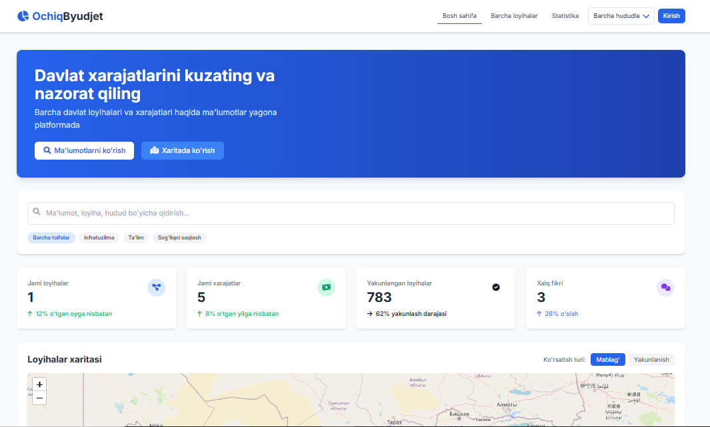
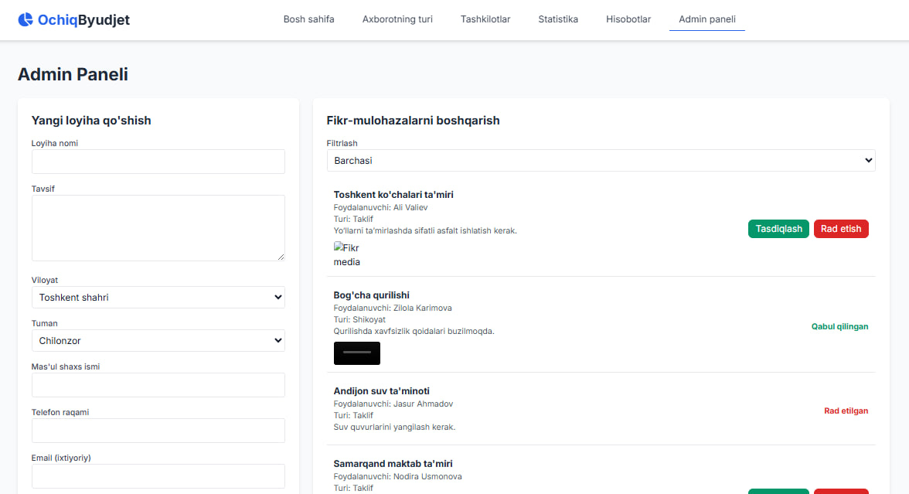
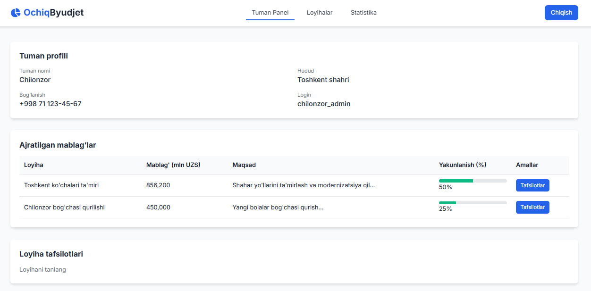
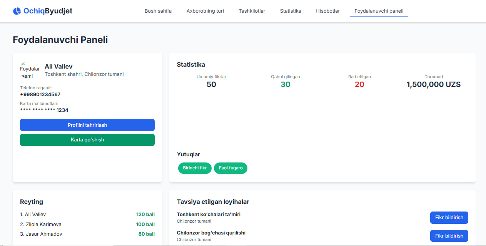

# 🌐 Ochiq Byudjet - Davlat Xarajatlarini Nazorat Qilish Platformasi

Ochiq Byudjet - bu davlat byudjeti xarajatlarini shaffof tarzda kuzatish, loyiha ma'lumotlarini ommaga taqdim etish va fuqarolar ishtirokini rag‘batlantirish uchun mo‘ljallangan zamonaviy platforma. Ushbu loyiha fuqarolarga davlat resurslarining ishlatilishini ko‘rish va fikr-mulohaza bildirish imkonini beradi, shu bilan birga administratorlar uchun loyihalarni boshqarish vositasini taqdim etadi. 🌍
## 🎯 Loyiha Maqsadi
- Davlat xarajatlarini shaffoflashtirish va fuqarolarga nazorat qilish imkonini berish
- Ekologik va ijtimoiy loyihalarni real vaqt davomida samarali boshqarishni ta'minlash.
- Foydalanuvchilar bilan interaktiv muloqotni osonlashtirish va ularning takliflarini hisobga olish.

## ⚙️ Texnologiyalar

- Frontend: HTML5, CSS3 (Tailwind CSS), JavaScript (GSAP uchun animatsiyalar)💻
- Backend: Django (MVT) 🚀
- Ma'lumotlar Bazasi: PostgreSQL (kelajakda GIS qo‘shish uchun optimallashtirilgan) 🗃

## 📦 Asosiy funksiyalar

- Loyiha Kuzatishi: Tumanlar bo‘yicha loyihalar haqida to‘liq ma’lumot, byudjet va holatlar. 🗑✅❌
- Fikr-Mulohaza Tizimi: Fuqarolar taklif va shikoyatlarini yuborishi, media (rasm/video) bilan birga. 
- Admin Paneli: Loyihalarni boshqarish, statistika ko‘rish va fikrlarni moderatsiya qilish. 📱
- Responsiv Dizayn: Mobil va desktop qurilmalarda mukammal ishlash. 💬🚨
- Dinamik Ma’lumotlar: Real vaqtda yangilanadigan loyiha va foydalanuvchi ma’lumotlari. 📊📈

### 🔐 Foydalanuvchi Turlari va Huquqlari
- Oddiy Foydalanuvchi: Loyihalarni ko‘rish, fikr bildirish.
- Loyihaga ma'sul shaxs: Loyiha bo'yicha admin tashlagan rejaga binoan qilingan ishlar rasmi, xarajatlar cheklarini yuklaydi.
- Admin: Loyiha qo‘shish/o‘chirish, fikrlarni tasdiqlash/rad etish.

### 🚀 Kelajakdagi Rivojlanishlar
- Real-vaqt Yangilanishlar: WebSocket yordamida loyiha holatini ko‘rsatish.. 📩
- Push Xabarnomalar: Foydalanuvchilarga loyiha yangilanishlari haqida xabar berish. 📊
- Mobil Ilova: Android/iOS uchun native ilova ishlab chiqish. 🗺
## 📷 Namunalar:









## 🚀 Ishga tushirish

### 1. Repository-ni klonlash:
### Backend
```bash
git clone https://github.com/SafarovSardorDev/ochiq_budget_platform
cd clean-area-platform
```
### 2. Virtual muhit va kutubxonalarni o‘rnatish:
```bash
python -m venv venv
source venv/bin/activate  # Windows: venv\Scripts\activate
pip install -r requirements.txt
```
### 3. Django migratsiyalar va admin foydalanuvchi:
```bash
python manage.py migrate
python manage.py createsuperuser
```
### 4. Serverni ishga tushirish:
```bash
python manage.py runserver
```
### Brauzerda Platformani ochish:
- Brauzerda http://127.0.0.1:8000/ manziliga o'ting (yoki frontendning localhost portiga). 🌐
- Platforma ishga tushganini va barcha funksiyalarni sinab ko'ring. 🧑‍💻

### Fuqarolarning ariza yuborishlarini osonlashtirish uchun Telegram bot:
Telegram Bot: [@Ochiq Budget Ariza Bot](https://t.me/ochiq_budjet_support_bot.)

## 👤 Muallif
 
Created by AutoMation team ✨
Telegram: [@imsafarov](https://t.me/imsafarov)

###📜 Litsenziya
This project is licensed under the MIT License - see the LICENSE file for details. 📝

Copyright (c) 2025 Sardor
